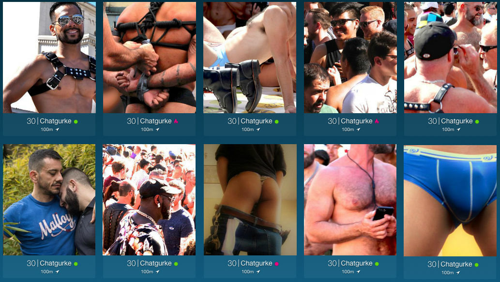

# Erasys JavaScript Trial Task,
completed by Esben Holk @ https://github.com/esbenholk/react-express-starter/tree/erasys-trial

## Requirements
- Create a JavaScript app (you can use your favorite `npm` packages and frameworks) that shows the results in a layout similar to the following screenshot:

- Each user item shows the following data:
  - Username 
  - Age
  - Image
  - Location and distance
  - Headline
  - Relative last login time (e.g. 6 minutes ago)